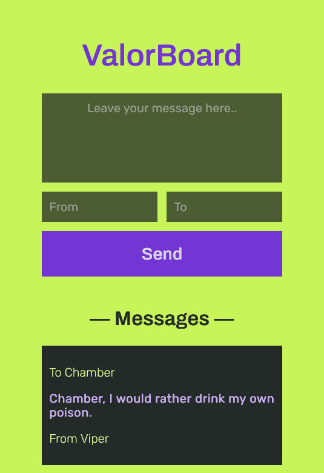

# ValorBoard

ValorBoard is a message board application inspired by the color theme of Gekko from VALORANT. It functions as a Progressive Web App (PWA) and provides users with the ability to post messages, reminiscent of the in-game mails exchanged among VALORANT agents.

### Screenshot

### Link

- Live Site URL: [Netlify](https://valorboard.netlify.app)

### Built with

- HTML
- CSS
- JavaScript
- Firebase

### Continued development

- A like button can be added to the messages, restricted to one like per user.
- The desktop version can be improved to utilise the extra space.
